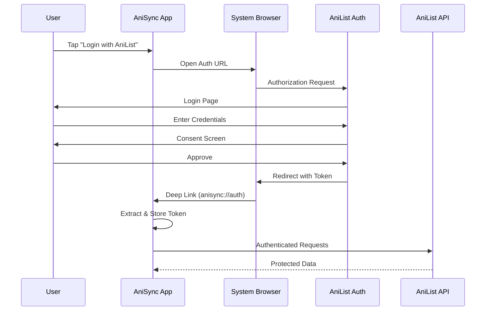

# API Integration

This document covers AniSync's integration with the AniList GraphQL API, including authentication, queries, mutations, and error handling.

---

## Table of Contents

1. [Overview](#overview)
2. [Authentication](#authentication)
3. [GraphQL Operations](#graphql-operations)
4. [Error Handling](#error-handling)
5. [Rate Limiting](#rate-limiting)

---

## Overview

AniSync uses the [AniList GraphQL API](https://anilist.gitbook.io/anilist-apiv2-docs/) for all anime/manga data and user interactions.

### API Configuration

- **Endpoint**: `https://graphql.anilist.co`
- **Authentication**: OAuth 2.0 Bearer Token
- **Client**: Apollo Kotlin 4.x
- **Schema**: Auto-generated from GraphQL introspection

---

## Authentication

### OAuth 2.0 Flow



### Token Storage

Tokens are stored securely using `EncryptedSharedPreferences`:

```kotlin
class AuthRepository @Inject constructor(
    @ApplicationContext private val context: Context
) {
    private val prefs = EncryptedSharedPreferences.create(
        context,
        "auth_prefs",
        MasterKey.Builder(context)
            .setKeyScheme(MasterKey.KeyScheme.AES256_GCM)
            .build(),
        EncryptedSharedPreferences.PrefKeyEncryptionScheme.AES256_SIV,
        EncryptedSharedPreferences.PrefValueEncryptionScheme.AES256_GCM
    )

    fun saveToken(token: String) {
        prefs.edit().putString("access_token", token).apply()
    }

    fun getToken(): String? {
        return prefs.getString("access_token", null)
    }
}
```

### Apollo Client Configuration

```kotlin
@Module
@InstallIn(SingletonComponent::class)
object ApolloModule {
    
    @Provides
    @Singleton
    fun provideApolloClient(
        authorizationInterceptor: AuthorizationInterceptor,
        @ApplicationContext context: Context
    ): ApolloClient {
        // Two-tier normalized cache: Memory (10 MB) → SQLite
        val sqlNormalizedCacheFactory = SqlNormalizedCacheFactory(context, "apollo_cache.db")
        val memoryFirstThenSqlCacheFactory = MemoryCacheFactory(maxSizeBytes = 10 * 1024 * 1024)
            .chain(sqlNormalizedCacheFactory)

        return ApolloClient.Builder()
            .serverUrl("https://graphql.anilist.co")
            .addHttpInterceptor(authorizationInterceptor)
            .normalizedCache(memoryFirstThenSqlCacheFactory)
            .build()
    }
}

class AuthorizationInterceptor @Inject constructor(
    private val authRepository: AuthRepository
) : HttpInterceptor {
    
    override suspend fun intercept(
        request: HttpRequest,
        chain: HttpInterceptorChain
    ): HttpResponse {
        val token = authRepository.getToken()
        
        val newRequest = if (token != null) {
            request.newBuilder()
                .addHeader("Authorization", "Bearer $token")
                .build()
        } else {
            request
        }
        
        return chain.proceed(newRequest)
    }
}
```

---

## GraphQL Operations

### Operations Overview

```mermaid
flowchart TB
    subgraph "Queries (18)"
        Q1[GetViewer]
        Q2[GetMediaDetails]
        Q3[GetUserLibrary]
        Q4[SearchMedia]
        Q5[GetTrending]
        Q6[AiringSchedule]
        Q7[GetNotifications]
        Q8[GetCharacterDetails]
        Q9[GetUserProfile]
        Q10[GetUserFavorites]
        Q11[GetUserActivities]
        Q12[GetUserStatistics]
        Q13[NextAiringEpisodes]
        Q14[GetPlanningUpcomingEpisodes]
        Q15[GetPlanningFirstEpisodes]
        Q16[GetMediaBySort]
        Q17[GetUpcomingMedia]
        Q18[GetPaginatedMedia]
    end

    subgraph "Mutations (4)"
        M1[SaveMediaListEntry]
        M2[DeleteMediaListEntry]
        M3[ToggleFavourite]
        M4[UpdateAbout]
    end

    subgraph "Data Flow"
        API[(AniList API)]
        CACHE[(Local Cache)]
    end

    Q1 & Q2 & Q3 & Q4 & Q5 & Q6 & Q7 & Q8 & Q9 & Q10 & Q11 & Q12 & Q13 & Q14 & Q15 & Q16 & Q17 & Q18 --> API
    M1 & M2 & M3 & M4 --> API
    API --> CACHE
```



### Key Queries

> **Note:** The queries below show comprehensive field sets for reference. The actual 
> implementations may use subsets of these fields depending on screen requirements. 
> See the `.graphql` files in `app/src/main/graphql/` for current implementations.

#### GetViewer (Current User)

```graphql
query GetViewer {
    Viewer {
        id
        name
        avatar {
            large
        }
        bannerImage
        statistics {
            anime {
                count
                episodesWatched
                minutesWatched
            }
        }
    }
}
```

#### GetMediaDetails

```graphql
query GetMediaDetails($id: Int!) {
    Media(id: $id) {
        id
        title {
            userPreferred
            english
            native
        }
        coverImage {
            extraLarge
            large
        }
        bannerImage
        description(asHtml: false)
        format
        status
        episodes
        duration
        season
        seasonYear
        averageScore
        popularity
        genres
        studios(isMain: true) {
            nodes {
                name
            }
        }
        characters(sort: [ROLE, FAVOURITES_DESC], perPage: 10) {
            edges {
                role
                voiceActors(language: JAPANESE) {
                    name {
                        userPreferred
                    }
                    image {
                        large
                    }
                }
                node {
                    id
                    name {
                        userPreferred
                    }
                    image {
                        large
                    }
                }
            }
        }
        relations {
            edges {
                relationType
                node {
                    id
                    title {
                        userPreferred
                    }
                    coverImage {
                        large
                    }
                    format
                    type
                }
            }
        }
        externalLinks {
            site
            url
            type
            icon
            color
        }
    }
}
```

#### AiringSchedule

```graphql
query AiringSchedule(
    $page: Int
    $perPage: Int
    $airingAtGreater: Int
    $airingAtLesser: Int
) {
    Page(page: $page, perPage: $perPage) {
        airingSchedules(
            airingAt_greater: $airingAtGreater
            airingAt_lesser: $airingAtLesser
            sort: [TIME]
        ) {
            id
            airingAt
            episode
            media {
                id
                title {
                    userPreferred
                }
                coverImage {
                    extraLarge
                }
                format
            }
        }
    }
}
```

### Key Mutations

#### SaveMediaListEntry

```graphql
mutation SaveMediaListEntry(
    $mediaId: Int!
    $status: MediaListStatus
    $progress: Int
    $score: Float
    $notes: String
) {
    SaveMediaListEntry(
        mediaId: $mediaId
        status: $status
        progress: $progress
        score: $score
        notes: $notes
    ) {
        id
        mediaId
        status
        progress
        score
        notes
        updatedAt
    }
}
```

#### DeleteMediaListEntry

```graphql
mutation DeleteMediaListEntry($id: Int!) {
    DeleteMediaListEntry(id: $id) {
        deleted
    }
}
```

---

## Error Handling

### Error Types

| Error Code | Description | Handling |
|------------|-------------|----------|
| 400 | Bad Request | Fix query/variables |
| 401 | Unauthorized | Re-authenticate |
| 404 | Not Found | Show error message |
| 429 | Rate Limited | Retry with backoff |
| 500 | Server Error | Retry or show error |

### Error Handling Implementation

```kotlin
sealed interface ApiResult<out T> {
    data class Success<T>(val data: T) : ApiResult<T>
    data class Error(
        val message: String,
        val code: Int? = null,
        val exception: Throwable? = null
    ) : ApiResult<Nothing>
}

suspend fun <T> safeApiCall(
    call: suspend () -> ApolloResponse<T>
): ApiResult<T> {
    return try {
        val response = call()
        
        when {
            response.hasErrors() -> {
                val error = response.errors?.firstOrNull()
                ApiResult.Error(
                    message = error?.message ?: "Unknown error",
                    code = error?.extensions?.get("code") as? Int
                )
            }
            response.data != null -> {
                ApiResult.Success(response.data!!)
            }
            else -> {
                ApiResult.Error("No data received")
            }
        }
    } catch (e: ApolloNetworkException) {
        ApiResult.Error("Network error", exception = e)
    } catch (e: ApolloHttpException) {
        ApiResult.Error("HTTP error: ${e.statusCode}", code = e.statusCode, exception = e)
    } catch (e: Exception) {
        ApiResult.Error("Unexpected error", exception = e)
    }
}
```

---

## Rate Limiting

AniList has rate limits to prevent abuse:

| Limit Type | Value |
|------------|-------|
| Per Minute | 90 requests |
| Per Second | ~1.5 requests |

### Rate Limit Handling

```kotlin
class RateLimitInterceptor : HttpInterceptor {
    private var retryAfter: Long = 0

    override suspend fun intercept(
        request: HttpRequest,
        chain: HttpInterceptorChain
    ): HttpResponse {
        // Wait if we're rate limited
        val waitTime = retryAfter - System.currentTimeMillis()
        if (waitTime > 0) {
            delay(waitTime)
        }

        val response = chain.proceed(request)

        // Check for rate limit headers
        response.headers.forEach { (name, value) ->
            when (name.lowercase()) {
                "x-ratelimit-remaining" -> {
                    if (value.toIntOrNull() == 0) {
                        // Approaching limit, slow down
                    }
                }
                "retry-after" -> {
                    retryAfter = System.currentTimeMillis() + 
                        (value.toLongOrNull() ?: 60) * 1000
                }
            }
        }

        return response
    }
}
```

---

## Related Documentation

- [ARCHITECTURE.md](ARCHITECTURE.md) - Overall app architecture
- [DATABASE.md](DATABASE.md) - Local caching of API data
- [WIDGETS.md](WIDGETS.md) - Widgets using API data
