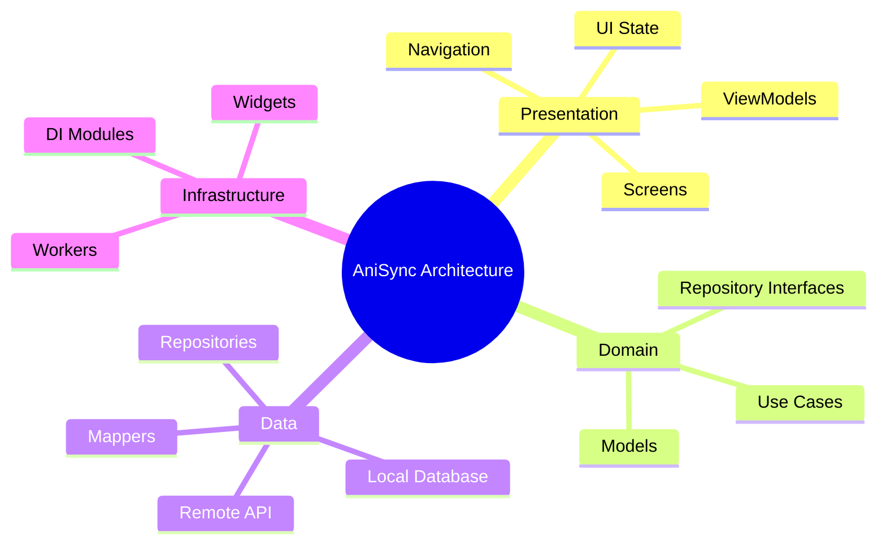
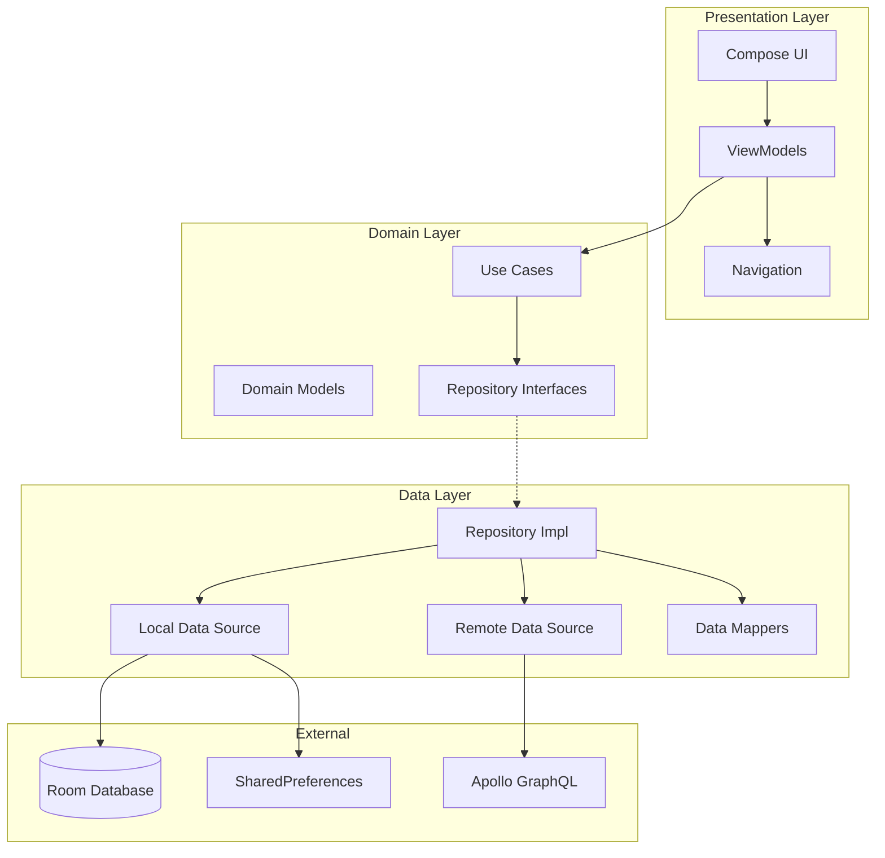
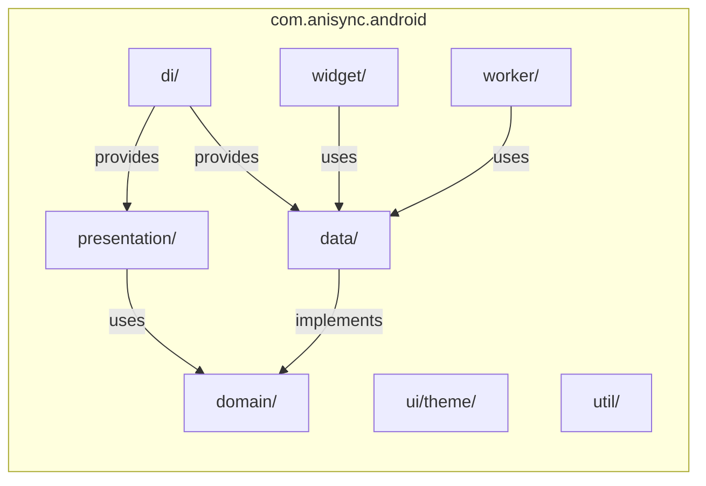
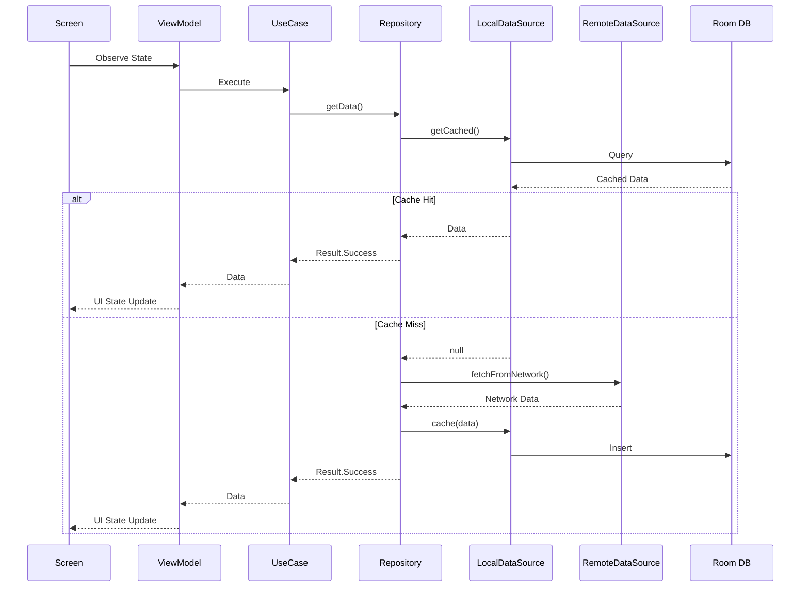
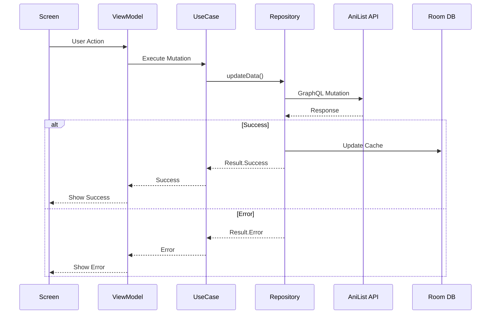
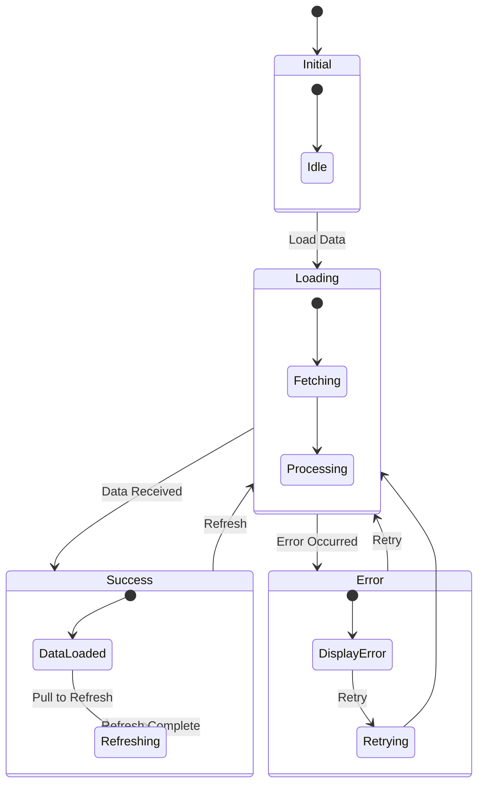
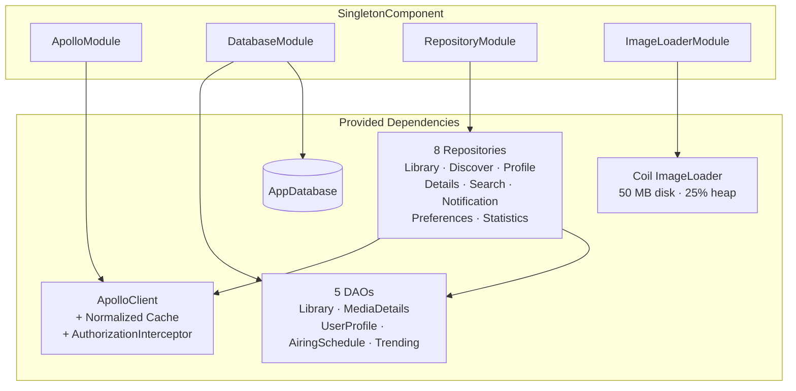
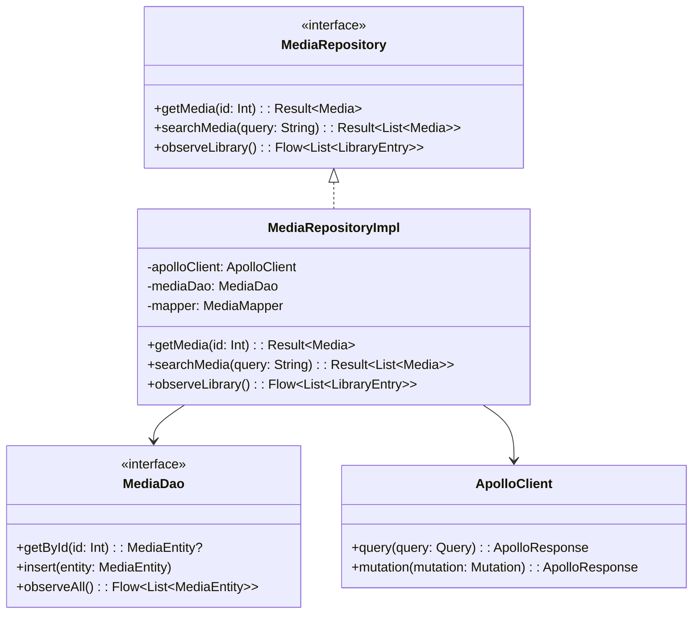
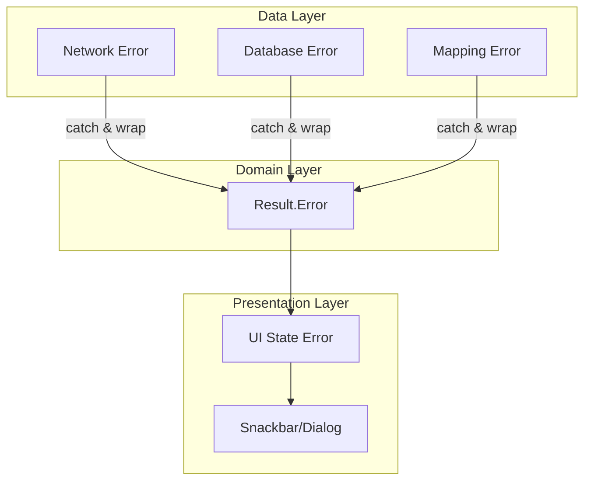

# Architecture

This document describes AniSync's system architecture, patterns, and design decisions.

---

## Table of Contents

1. [Overview](#overview)
2. [Layered Architecture](#layered-architecture)
3. [Package Structure](#package-structure)
4. [Data Flow](#data-flow)
5. [State Management](#state-management)
6. [Dependency Injection](#dependency-injection)
7. [Design Patterns](#design-patterns)

---

## Overview

AniSync follows **MVVM + Clean Architecture** with clear separation of concerns:



---

## Layered Architecture



### Layer Responsibilities

| Layer | Responsibility | Dependencies |
|-------|----------------|--------------|
| **Presentation** | UI rendering, user interaction, navigation | Domain layer only |
| **Domain** | Business logic, use cases, domain models | None (pure Kotlin) |
| **Data** | Data access, caching, network calls | Domain interfaces |

---

## Package Structure



### Package Details

```
com.anisync.android/
├── data/
│   ├── local/              # Room database
│   │   ├── dao/            # Data Access Objects
│   │   ├── entity/         # Room entities
│   │   └── AppDatabase.kt
│   ├── remote/             # API clients (Apollo)
│   ├── repository/         # Repository implementations
│   └── mapper/             # Entity ↔ Domain mappers
├── di/                     # Hilt modules
├── domain/
│   ├── model/              # Domain models
│   ├── repository/         # Repository interfaces
│   └── usecase/            # Business logic
├── presentation/
│   ├── components/         # Shared UI components
│   ├── details/            # Media details and related logic/screens
│   ├── discover/           # Discover/browse and related logic/screens
│   ├── library/            # Library management and related logic/screens
│   ├── login/              # Authentication screen
│   ├── navigation/         # Nav graph & routes
│   ├── profile/            # User profile screen
│   ├── settings/           # Settings screens & components
│   ├── statistics/         # User statistics screen
│   └── util/               # Presentation utilities
├── ui/theme/               # Material 3 theming (MaterialKolor)
├── util/                   # Extensions & helpers
├── widget/                 # Glance widgets
└── worker/                 # WorkManager jobs
```

---

## Data Flow

### Read Operation Flow



### Write Operation Flow



---

## State Management

### ViewModel State Pattern



### UI State Structure

```kotlin
data class MediaListUiState(
    val isLoading: Boolean = false,
    val isRefreshing: Boolean = false,
    val media: List<Media> = emptyList(),
    val selectedFilter: Filter = Filter.ALL,
    val error: String? = null
)

sealed interface MediaListAction {
    data object Refresh : MediaListAction
    data object Retry : MediaListAction
    data class SelectFilter(val filter: Filter) : MediaListAction
    data class SelectMedia(val media: Media) : MediaListAction
}
```

AniSync enforces a strict **Unidirectional Data Flow (UDF)** pattern:
1. **State (`*UiState`)**: ViewModels expose a single cohesive `StateFlow<UiState>` representing the entire screen state.
2. **Actions (`*Action`)**: User intents and events are sent from the UI to the ViewModel through a single unified `onAction(action: *Action)` function. (Note: We use the `Action` suffix exclusively, avoiding the `Event` suffix for UI-to-ViewModel communication).

---

## Dependency Injection

### Hilt Module Structure



### Module Details

| Module | Scope | Provides |
|--------|-------|----------|
| `ApolloModule` | Singleton | `ApolloClient` with two-tier normalized cache (Memory 10 MB + SQLite) and `AuthorizationInterceptor` |
| `DatabaseModule` | Singleton | `AppDatabase` (Room) + 5 DAOs: `LibraryDao`, `MediaDetailsDao`, `UserProfileDao`, `AiringScheduleDao`, `TrendingDao` |
| `RepositoryModule` | Singleton | 8 repository bindings: Library, Discover, Profile, Details, Search, Notification, Preferences, Statistics |
| `ImageLoaderModule` | Singleton | Coil `ImageLoader` with 50 MB disk cache, 25% heap memory cache, 200ms crossfade |

### Module Examples

```kotlin
@Module
@InstallIn(SingletonComponent::class)
object DatabaseModule {
    @Provides
    @Singleton
    fun provideDatabase(@ApplicationContext context: Context): AppDatabase {
        return Room.databaseBuilder(context, AppDatabase::class.java, "anisync.db")
            .addMigrations(*Migrations.ALL_MIGRATIONS)
            .fallbackToDestructiveMigration(dropAllTables = true) // ⚠️ Remove before production!
            .build()
    }

    @Provides
    fun provideLibraryDao(db: AppDatabase): LibraryDao = db.libraryDao()
    // + MediaDetailsDao, UserProfileDao, AiringScheduleDao, TrendingDao
}

@Module
@InstallIn(SingletonComponent::class)
abstract class RepositoryModule {
    @Binds @Singleton
    abstract fun bindLibraryRepository(impl: LibraryRepositoryImpl): LibraryRepository
    @Binds @Singleton
    abstract fun bindDiscoverRepository(impl: DiscoverRepositoryImpl): DiscoverRepository
    // + Profile, Details, Search, Notification, Preferences, Statistics
}
```

---

## Design Patterns

### Repository Pattern



### Use Case Pattern

```kotlin
class GetMediaDetailsUseCase @Inject constructor(
    private val mediaRepository: MediaRepository,
    private val characterRepository: CharacterRepository
) {
    suspend operator fun invoke(mediaId: Int): Result<MediaDetails> {
        return when (val mediaResult = mediaRepository.getMedia(mediaId)) {
            is Result.Success -> {
                val characters = characterRepository.getCharacters(mediaId)
                Result.Success(
                    MediaDetails(
                        media = mediaResult.data,
                        characters = characters.getOrDefault(emptyList())
                    )
                )
            }
            is Result.Error -> mediaResult
        }
    }
}
```

### Mapper Pattern

```kotlin
class MediaMapper @Inject constructor() {
    fun toDomain(entity: MediaEntity): Media {
        return Media(
            id = entity.id,
            title = entity.titleUserPreferred,
            coverUrl = entity.coverUrl,
            // ... other mappings
        )
    }

    fun toEntity(dto: MediaFragment): MediaEntity {
        return MediaEntity(
            id = dto.id,
            titleUserPreferred = dto.title?.userPreferred ?: "",
            coverUrl = dto.coverImage?.large,
            // ... other mappings
        )
    }
}
```

---

## Error Handling

### Result Wrapper

```kotlin
sealed interface Result<out T> {
    data class Success<T>(val data: T) : Result<T>
    data class Error(
        val message: String,
        val exception: Throwable? = null
    ) : Result<Nothing>
}

// Extension functions available in domain/Result.kt:
// - fold(), map(), getOrNull(), getOrDefault()
// - onSuccess(), onError(), flatMap()
// - isSuccess(), isError()
```

### Error Propagation



---

## Related Documentation

- [DATABASE.md](DATABASE.md) - Database schema and migrations
- [API.md](API.md) - GraphQL API integration
- [NAVIGATION.md](NAVIGATION.md) - Navigation architecture
- [WIDGETS.md](WIDGETS.md) - Widget architecture
