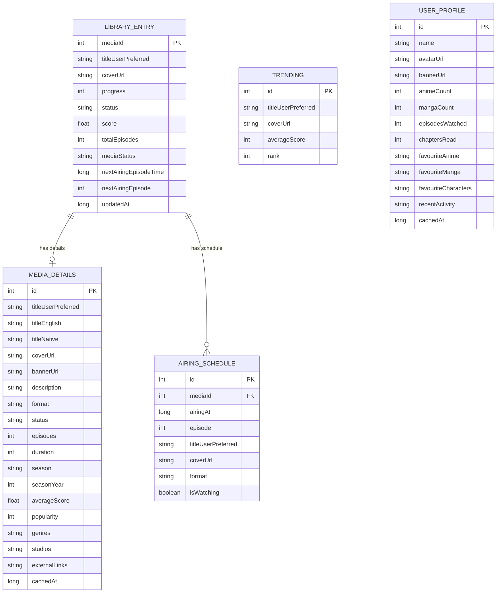
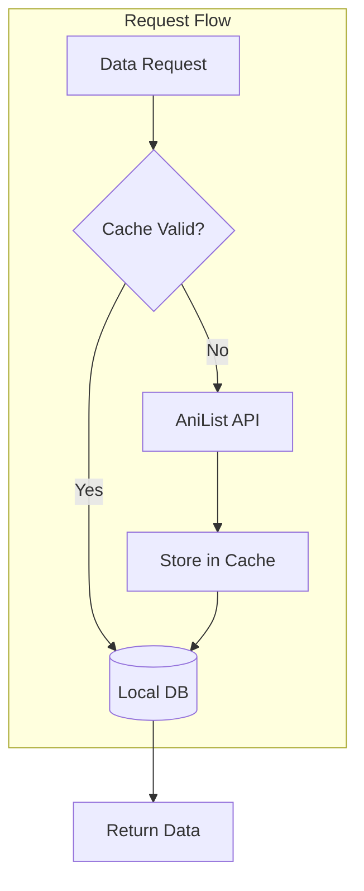

# Database

This document covers AniSync's Room database schema, entities, DAOs, migration strategy, and caching approach.

---

## Table of Contents

1. [Overview](#overview)
2. [Entity Schema](#entity-schema)
3. [DAO Reference](#dao-reference)
4. [Caching Strategy](#caching-strategy)
5. [Migration Guidelines](#migration-guidelines)
6. [Production Checklist](#production-checklist)

---

## Overview

AniSync uses **Room** (SQLite abstraction) for local data persistence with an offline-first architecture.

### Database Configuration

```kotlin
@Database(
    entities = [
        LibraryEntryEntity::class,
        MediaDetailsEntity::class,
        UserProfileEntity::class,
        AiringScheduleEntity::class,
        TrendingEntity::class
    ],
    version = 1,
    exportSchema = true  // Enables schema export for migration testing
)
@TypeConverters(Converters::class)
abstract class AppDatabase : RoomDatabase() {
    abstract fun libraryDao(): LibraryDao
    abstract fun mediaDetailsDao(): MediaDetailsDao
    abstract fun userProfileDao(): UserProfileDao
    abstract fun airingScheduleDao(): AiringScheduleDao
    abstract fun trendingDao(): TrendingDao
}
```

---

## Entity Schema

### Entity Relationship Diagram



### Entity Definitions

#### LibraryEntryEntity

User's anime/manga library entries with watch progress.

```kotlin
@Entity(tableName = "library_entries")
data class LibraryEntryEntity(
    @PrimaryKey val mediaId: Int,
    val titleUserPreferred: String,
    val coverUrl: String?,
    val progress: Int,
    val status: LibraryStatus,        // CURRENT, PLANNING, COMPLETED, etc.
    val score: Float?,
    val totalEpisodes: Int?,
    val mediaStatus: String?,         // RELEASING, FINISHED, etc.
    val nextAiringEpisodeTime: Long?,
    val nextAiringEpisode: Int?,
    val updatedAt: Long = System.currentTimeMillis()
)
```

#### MediaDetailsEntity

Comprehensive media information with JSON fields for complex data.

```kotlin
@Entity(tableName = "media_details")
data class MediaDetailsEntity(
    @PrimaryKey val id: Int,
    val titleUserPreferred: String,
    val titleEnglish: String?,
    val titleNative: String?,
    val coverUrl: String?,
    val bannerUrl: String?,
    val description: String?,
    val format: String?,
    val status: String?,
    val episodes: Int?,
    val duration: Int?,
    val season: String?,
    val seasonYear: Int?,
    val averageScore: Float?,
    val popularity: Int?,
    @TypeConverters(Converters::class)
    val genres: List<String>,         // JSON serialized
    @TypeConverters(Converters::class)
    val studios: List<String>,        // JSON serialized
    @TypeConverters(Converters::class)
    val externalLinks: List<ExternalLink>,  // JSON serialized
    val cachedAt: Long = System.currentTimeMillis()
)
```

#### AiringScheduleEntity

Episode airing times for widgets and notifications.

```kotlin
@Entity(tableName = "airing_schedules")
data class AiringScheduleEntity(
    @PrimaryKey val id: Int,
    val mediaId: Int,
    val airingAt: Long,              // Unix timestamp (seconds)
    val episode: Int,
    val titleUserPreferred: String,
    val coverUrl: String?,
    val format: String?,
    val isWatching: Boolean          // User is watching this anime
)
```

---

## DAO Reference

### LibraryDao

```kotlin
@Dao
interface LibraryDao {
    @Query("SELECT * FROM library_entries WHERE status = :status ORDER BY updatedAt DESC")
    fun getByStatus(status: LibraryStatus): Flow<List<LibraryEntryEntity>>

    @Query("SELECT * FROM library_entries WHERE mediaType = :type")
    suspend fun getByType(type: MediaType): List<LibraryEntryEntity>

    @Query("""
        SELECT * FROM library_entries 
        WHERE status = 'CURRENT' 
        AND (mediaStatus = 'RELEASING' OR mediaStatus IS NULL)
        ORDER BY nextAiringEpisodeTime ASC
    """)
    suspend fun getUpNext(): List<LibraryEntryEntity>

    @Query("SELECT * FROM library_entries WHERE mediaId = :mediaId")
    suspend fun getEntry(mediaId: Int): LibraryEntryEntity?

    @Insert(onConflict = OnConflictStrategy.REPLACE)
    suspend fun insert(entry: LibraryEntryEntity)

    @Insert(onConflict = OnConflictStrategy.REPLACE)
    suspend fun insertAll(entries: List<LibraryEntryEntity>)

    @Delete
    suspend fun delete(entry: LibraryEntryEntity)

    @Query("DELETE FROM library_entries")
    suspend fun clearAll()
}
```

### AiringScheduleDao

```kotlin
@Dao
interface AiringScheduleDao {
    @Query("""
        SELECT * FROM airing_schedules 
        WHERE airingAt >= :startTime AND airingAt < :endTime
        ORDER BY airingAt ASC
    """)
    suspend fun getAiringBetween(startTime: Long, endTime: Long): List<AiringScheduleEntity>

    @Query("""
        SELECT * FROM airing_schedules 
        WHERE airingAt >= :startTime AND airingAt < :endTime
        AND isWatching = 1
        ORDER BY airingAt ASC
    """)
    suspend fun getAiringBetweenForUser(startTime: Long, endTime: Long): List<AiringScheduleEntity>

    @Insert(onConflict = OnConflictStrategy.REPLACE)
    suspend fun insertAll(schedules: List<AiringScheduleEntity>)

    @Query("DELETE FROM airing_schedules")
    suspend fun clearAll()
}
```

---

## Caching Strategy

### Cache Flow Diagram



### Cache Policies

| Data Type | TTL | Strategy |
|-----------|-----|----------|
| Library Entries | ∞ | Always fresh (user data) |
| Media Details | 24 hours | Stale-while-revalidate |
| User Profile | 1 hour | Stale-while-revalidate |
| Airing Schedule | 6 hours | Replace on refresh |
| Trending | 1 hour | Replace on refresh |

### Implementation

```kotlin
class MediaRepositoryImpl @Inject constructor(
    private val apolloClient: ApolloClient,
    private val mediaDetailsDao: MediaDetailsDao
) : MediaRepository {

    override suspend fun getMediaDetails(id: Int): Result<MediaDetails> {
        // Check cache first
        val cached = mediaDetailsDao.getById(id)
        
        if (cached != null && !cached.isStale()) {
            return Result.Success(cached.toDomain())
        }

        // Fetch from network
        return try {
            val response = apolloClient.query(GetMediaDetailsQuery(id)).execute()
            response.data?.Media?.let { dto ->
                val entity = dto.toEntity()
                mediaDetailsDao.insert(entity)
                Result.Success(entity.toDomain())
            } ?: Result.Error("Media not found")
        } catch (e: Exception) {
            // Return stale cache if available
            cached?.let { Result.Success(it.toDomain()) }
                ?: Result.Error("Network error", e)
        }
    }
}

private fun MediaDetailsEntity.isStale(): Boolean {
    val cacheAge = System.currentTimeMillis() - cachedAt
    return cacheAge > 24.hours.inWholeMilliseconds
}
```

---

## Migration Guidelines

### Migration Infrastructure

The project uses a dedicated `Migrations.kt` file for all database migrations:

```kotlin
object Migrations {
    /**
     * All migrations to be applied by Room.
     * Add new migrations here in order.
     */
    val ALL_MIGRATIONS: Array<Migration> = arrayOf(
        // MIGRATION_1_2,
        // MIGRATION_2_3,
    )

    // Example migration template:
    // val MIGRATION_1_2 = migration(1, 2) { db ->
    //     db.execSQL("ALTER TABLE library_entries ADD COLUMN newField TEXT")
    // }
}
```

### Creating a New Migration

1. **Increment database version** in `AppDatabase.kt`
2. **Create migration** in `Migrations.kt`
3. **Add to ALL_MIGRATIONS array**
4. **Test the migration**

```kotlin
// Step 1: In AppDatabase.kt
@Database(
    entities = [...],
    version = 2,  // Incremented from 1
    exportSchema = true
)

// Step 2: In Migrations.kt
val MIGRATION_1_2 = migration(1, 2) { db ->
    db.execSQL("""
        ALTER TABLE library_entries 
        ADD COLUMN notes TEXT DEFAULT NULL
    """)
}

// Step 3: Add to array
val ALL_MIGRATIONS: Array<Migration> = arrayOf(
    MIGRATION_1_2,
)
```

### Migration Testing

```kotlin
@RunWith(AndroidJUnit4::class)
class MigrationTest {
    
    @get:Rule
    val helper = MigrationTestHelper(
        InstrumentationRegistry.getInstrumentation(),
        AppDatabase::class.java
    )

    @Test
    fun migrate1To2() {
        // Create version 1 database
        helper.createDatabase(TEST_DB, 1).apply {
            execSQL("""
                INSERT INTO library_entries (mediaId, titleUserPreferred, progress, status) 
                VALUES (1, 'Test Anime', 5, 'CURRENT')
            """)
            close()
        }

        // Run migration
        helper.runMigrationsAndValidate(TEST_DB, 2, true, MIGRATION_1_2)

        // Verify data preserved
        val db = helper.openNewDatabase()
        db.query("SELECT notes FROM library_entries WHERE mediaId = 1").use { cursor ->
            assertTrue(cursor.moveToFirst())
            assertNull(cursor.getString(0)) // Default value
        }
    }
}
```

---

## Production Checklist

> ⚠️ **CRITICAL: Before releasing to production, complete these steps!**

### Pre-Release Database Tasks

- [ ] **Remove `fallbackToDestructiveMigration()`** from `DatabaseModule.kt`
- [ ] **Verify all migrations** are tested and working
- [ ] **Export final schema** to `app/schemas/` directory
- [ ] **Test migration path** from all previous versions
- [ ] **Backup strategy** documented for users

### Current Development Configuration

```kotlin
// DatabaseModule.kt - DEVELOPMENT ONLY
Room.databaseBuilder(context, AppDatabase::class.java, "anisync.db")
    .addMigrations(*Migrations.ALL_MIGRATIONS)
    // ⚠️ REMOVE BEFORE PRODUCTION RELEASE!
    // This destroys all user data on schema changes.
    .fallbackToDestructiveMigration()
    .build()
```

### Production Configuration

```kotlin
// DatabaseModule.kt - PRODUCTION
Room.databaseBuilder(context, AppDatabase::class.java, "anisync.db")
    .addMigrations(*Migrations.ALL_MIGRATIONS)
    // NO fallbackToDestructiveMigration() - migrations handle schema changes
    .build()
```

---

## Schema Files

Schema JSON files are exported to `app/schemas/` for migration testing:

```
app/schemas/
└── com.anisync.android.data.local.AppDatabase/
    ├── 1.json    # Version 1 schema
    ├── 2.json    # Version 2 schema (after migration)
    └── ...
```

These files are **auto-generated** by Room when `exportSchema = true` and should be **committed to version control**.

---

## Related Documentation

- [ARCHITECTURE.md](ARCHITECTURE.md) - Overall app architecture
- [API.md](API.md) - GraphQL API (data source)
- [WIDGETS.md](WIDGETS.md) - Widgets that consume database data
