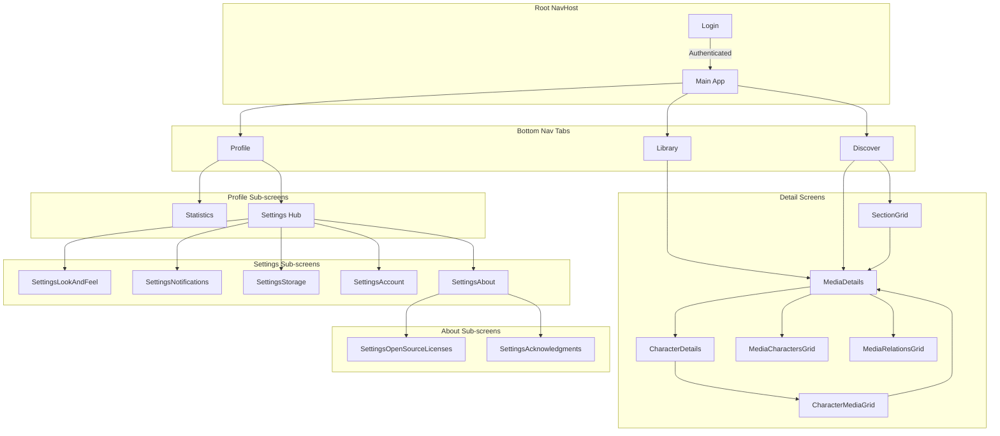
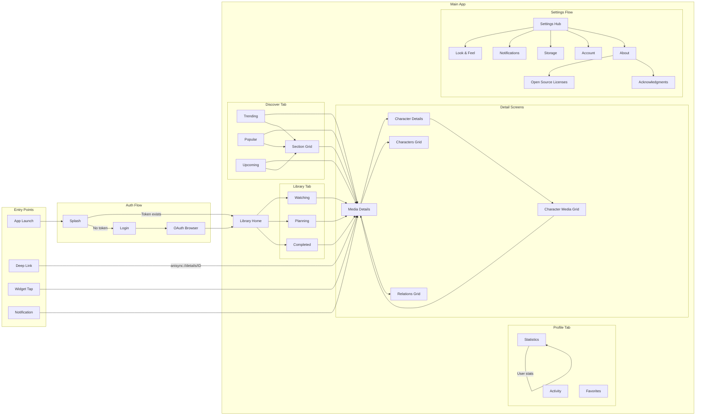
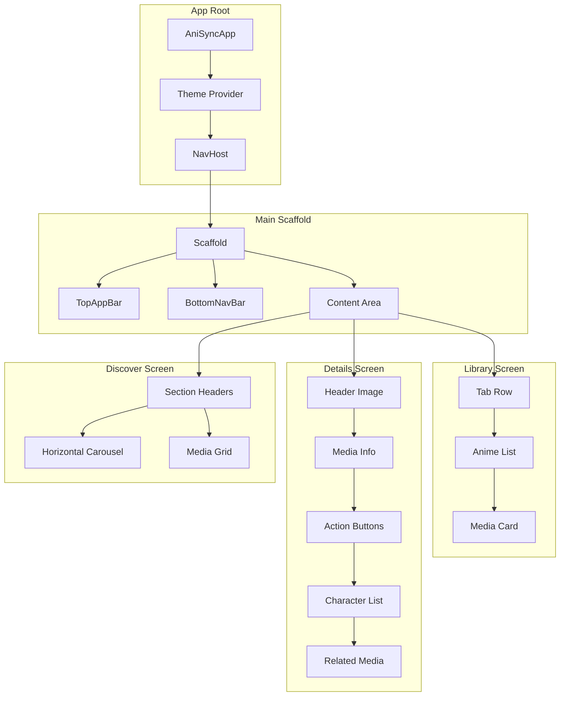

# Navigation

This document covers AniSync's navigation architecture, screen flows, routes, and deep linking.

---

## Table of Contents

1. [Overview](#overview)
2. [Navigation Graph](#navigation-graph)
3. [Screen Hierarchy](#screen-hierarchy)
4. [Route Definitions](#route-definitions)
5. [Deep Links](#deep-links)
6. [Transitions](#transitions)

---

## Overview

AniSync uses **Navigation Compose** with type-safe routes for all navigation:

- **Type-safe routes** using Kotlin serialization
- **Bottom navigation** for main destinations (Library, Discover, Profile)
- **Flat route structure** with `@Serializable` objects and data classes
- **Shared Axis transitions** (X-axis for tabs, Z-axis for detail/settings screens)
- **Deep link support** for external entry points

---

## Navigation Graph

### Main Navigation Structure



### Complete Navigation Flow



---

## Screen Hierarchy

### Component Tree



---

## Route Definitions

### Type-Safe Routes

```kotlin
// Navigation routes using Kotlin serialization
// All routes are flat top-level @Serializable objects/data classes (no sealed interface hierarchy)

// Simple destinations (no arguments)
@Serializable data object Login
@Serializable data object Library
@Serializable data object Discover
@Serializable data object Profile
@Serializable data object Statistics { val userId: Int }
@Serializable data object Settings
@Serializable data object SettingsLookAndFeel
@Serializable data object SettingsNotifications
@Serializable data object SettingsStorage
@Serializable data object SettingsAccount
@Serializable data object SettingsAbout
@Serializable data object SettingsOpenSourceLicenses
@Serializable data object SettingsAcknowledgments

// Parameterized destinations
@Serializable data class MediaDetails(val mediaId: Int, val sourceScreen: String = "unknown")
@Serializable data class CharacterDetails(val characterId: Int)
@Serializable data class SectionGrid(val sectionTitle: String, val sectionType: String, val mediaType: String = "ANIME")
@Serializable data class MediaCharactersGrid(val mediaId: Int, val mediaTitle: String)
@Serializable data class MediaRelationsGrid(val mediaId: Int, val mediaTitle: String)
@Serializable data class CharacterMediaGrid(val characterId: Int, val characterName: String)
```

### Navigation Setup

```kotlin
@Composable
fun AniSyncNavHost(
    navController: NavHostController,
    startDestination: Any
) {
    NavHost(
        navController = navController,
        startDestination = startDestination
    ) {
        // Auth
        composable<Login> {
            LoginScreen(
                onLoginSuccess = {
                    navController.navigate(Library) {
                        popUpTo(Login) { inclusive = true }
                    }
                }
            )
        }
        
        // Bottom nav tabs
        composable<Library> {
            LibraryScreen(
                onMediaClick = { id ->
                    navController.navigate(MediaDetails(mediaId = id))
                }
            )
        }
        
        composable<Discover> {
            DiscoverScreen(
                onMediaClick = { id ->
                    navController.navigate(MediaDetails(mediaId = id))
                },
                onSectionClick = { title, type ->
                    navController.navigate(SectionGrid(title, type))
                }
            )
        }
        
        composable<Profile> {
            ProfileScreen(
                onSettingsClick = {
                    navController.navigate(Settings)
                },
                onStatisticsClick = { userId ->
                    navController.navigate(Statistics(userId))
                }
            )
        }
        
        // Detail screens
        composable<MediaDetails> { backStackEntry ->
            val route = backStackEntry.toRoute<MediaDetails>()
            MediaDetailsScreen(
                mediaId = route.mediaId,
                onCharacterClick = { charId ->
                    navController.navigate(CharacterDetails(charId))
                },
                onRelatedMediaClick = { mediaId ->
                    navController.navigate(MediaDetails(mediaId))
                },
                onBackClick = { navController.popBackStack() }
            )
        }
        
        composable<CharacterDetails> { ... }
        composable<SectionGrid> { ... }
        composable<MediaCharactersGrid> { ... }
        composable<MediaRelationsGrid> { ... }
        composable<CharacterMediaGrid> { ... }
        composable<Statistics> { ... }
        
        // Settings flow
        composable<Settings> {
            SettingsScreen(
                onNavigateToLookAndFeel = { navController.navigate(SettingsLookAndFeel) },
                onNavigateToNotifications = { navController.navigate(SettingsNotifications) },
                onNavigateToStorage = { navController.navigate(SettingsStorage) },
                onNavigateToAccount = { navController.navigate(SettingsAccount) },
                onNavigateToAbout = { navController.navigate(SettingsAbout) }
            )
        }
        
        composable<SettingsLookAndFeel> { ... }
        composable<SettingsNotifications> { ... }
        composable<SettingsStorage> { ... }
        composable<SettingsAccount> { ... }
        composable<SettingsAbout> {
            SettingsAboutScreen(
                onOpenSourceLicenses = { navController.navigate(SettingsOpenSourceLicenses) },
                onAcknowledgments = { navController.navigate(SettingsAcknowledgments) }
            )
        }
        composable<SettingsOpenSourceLicenses> { ... }
        composable<SettingsAcknowledgments> { ... }
    }
}
```

---

## Deep Links

### Supported Deep Links

| URI Pattern | Destination | Example |
|-------------|-------------|---------|
| `anisync://details/{id}` | Media Details | `anisync://details/21` |
| `anisync://search` | Search Screen | `anisync://search` |
| `anisync://search?q={query}` | Search with Query | `anisync://search?q=naruto` |
| `anisync://library` | Library Screen | `anisync://library` |
| `anisync://auth` | Auth Callback | `anisync://auth?token=...` |

### AndroidManifest Configuration

```xml
<activity
    android:name=".MainActivity"
    android:exported="true">
    
    <intent-filter>
        <action android:name="android.intent.action.MAIN" />
        <category android:name="android.intent.category.LAUNCHER" />
    </intent-filter>
    
    <!-- Deep links -->
    <intent-filter android:autoVerify="true">
        <action android:name="android.intent.action.VIEW" />
        <category android:name="android.intent.category.DEFAULT" />
        <category android:name="android.intent.category.BROWSABLE" />
        <data android:scheme="anisync" />
    </intent-filter>
</activity>
```

### Widget Intent Creation

```kotlin
object WidgetIntentUtils {
    fun createDetailsIntent(context: Context, mediaId: Int): Intent {
        return Intent(
            Intent.ACTION_VIEW,
            "anisync://details/$mediaId".toUri()
        ).apply {
            setClass(context, MainActivity::class.java)
            flags = Intent.FLAG_ACTIVITY_NEW_TASK
        }
    }
}
```

---

## Transitions

### Default Transitions

AniSync uses **Material Design Shared Axis** transitions:
- **X-axis** transitions for bottom navigation tab switches
- **Z-axis** transitions for detail and settings screen navigation

```kotlin
@Composable
fun AniSyncNavHost(...) {
    NavHost(
        navController = navController,
        startDestination = startDestination,
        // X-axis shared axis for tab navigation
        enterTransition = {
            materialSharedAxisXIn(forward = true, durationMillis = 300)
        },
        exitTransition = {
            materialSharedAxisXOut(forward = true, durationMillis = 300)
        },
        popEnterTransition = {
            materialSharedAxisXIn(forward = false, durationMillis = 300)
        },
        popExitTransition = {
            materialSharedAxisXOut(forward = false, durationMillis = 300)
        }
    ) {
        // Detail/Settings screens override with Z-axis transitions
        composable<MediaDetails>(
            enterTransition = { materialSharedAxisZIn(forward = true) },
            exitTransition = { materialSharedAxisZOut(forward = true) },
            popEnterTransition = { materialSharedAxisZIn(forward = false) },
            popExitTransition = { materialSharedAxisZOut(forward = false) }
        ) { ... }
    }
}
```

### Shared Element Transitions

```kotlin
// Media card in list
SharedTransitionLayout {
    AnimatedContent(targetState = ...) { ... }
}

// Media details header
composable<MediaDetails> {
    SharedTransitionScope {
        MediaDetailsScreen(
            sharedTransitionScope = this,
            animatedVisibilityScope = this@composable
        )
    }
}
```

---

## Bottom Navigation

### Bottom Nav Implementation

```kotlin
@Composable
fun MainBottomNavBar(
    navController: NavHostController,
    currentRoute: Any?
) {
    val items = listOf(
        BottomNavItem(
            route = Library,
            icon = Icons.Outlined.VideoLibrary,
            selectedIcon = Icons.Filled.VideoLibrary,
            label = "Library"
        ),
        BottomNavItem(
            route = Discover,
            icon = Icons.Outlined.Explore,
            selectedIcon = Icons.Filled.Explore,
            label = "Discover"
        ),
        BottomNavItem(
            route = Profile,
            icon = Icons.Outlined.Person,
            selectedIcon = Icons.Filled.Person,
            label = "Profile"
        )
    )
    
    NavigationBar {
        items.forEach { item ->
            val isSelected = currentRoute == item.route
            
            NavigationBarItem(
                selected = isSelected,
                onClick = {
                    navController.navigate(item.route) {
                        popUpTo(navController.graph.findStartDestination().id) {
                            saveState = true
                        }
                        launchSingleTop = true
                        restoreState = true
                    }
                },
                icon = {
                    Icon(
                        imageVector = if (isSelected) item.selectedIcon else item.icon,
                        contentDescription = item.label
                    )
                },
                label = { Text(item.label) }
            )
        }
    }
}
```

---

## Related Documentation

- [ARCHITECTURE.md](ARCHITECTURE.md) - Overall app architecture
- [WIDGETS.md](WIDGETS.md) - Widget navigation intents
- [CONTRIBUTING.md](CONTRIBUTING.md) - Adding new screens
